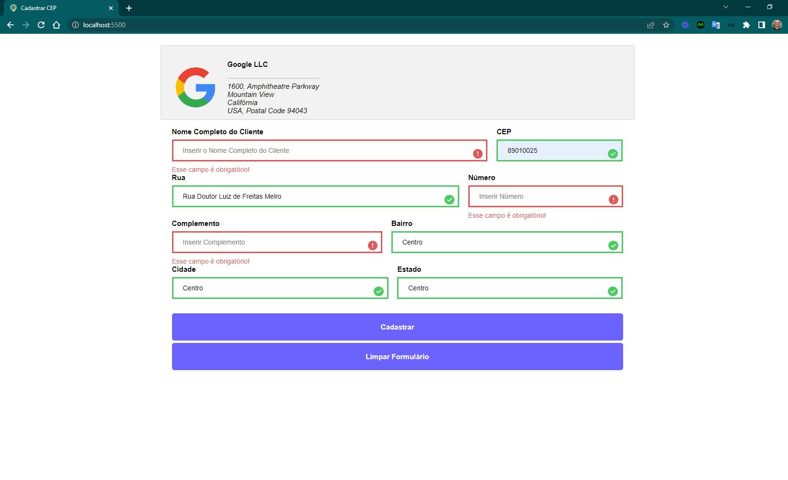
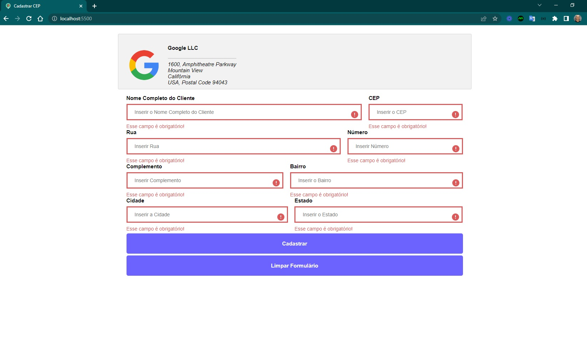
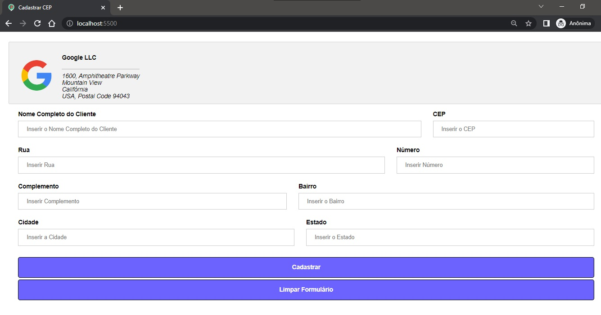
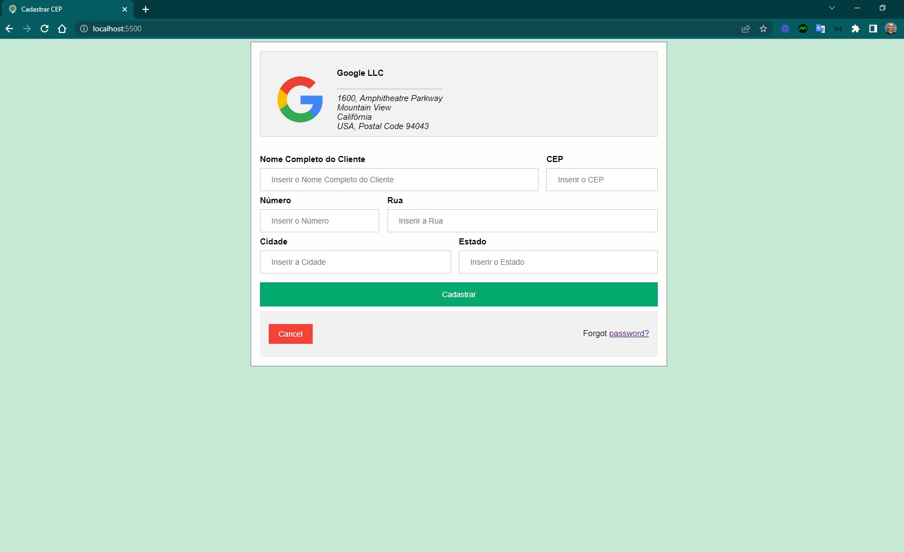

<h4 align="center"> 
	🚧 Cadastrar CEP 🚀
</h4>

  

 
 
Desenvolver uma aplicação utilizando javascript, css e html simulando a etapa de cadastro de endereço e escolha do mesmo para entregar de um produto.
 
#### REQUISITOS

- [x] a página deve possuir um logo com endereço da empresa
- [x] a página deve possuir um formulário com os campos nome do cliente e endereço
- [x] os campos devem ser preenchidos automaticamente após informar o cep
- [x] o formulário deve conter as validações necessárias
- [ ] salvar os endereços em localstorage
- [ ] uma segunda página ou aba dentro do mesmo formulário deve permitir ao usuário escolher entre os endereços previamente cadastrados como endereço para entrega, preenchendo assim os campos necessários
- [ ] a página deve permitir a exclusão de um endereço já cadastrado

#### EXTRAS

- [x] favicon
- [x] botão Enter vai para o próximo input com `enterkeyhint="next"`
- [x] atributo autocomplete
- [x] limpar o formulário para nova busca de cep
- [x] botão para limpar o formulário
- [x] validar as informações vindas da api cep
- [x] responsividade
- [ ] acessibilidade

#####  PONTOS DE DESTAQUE
	 
  - ARQUITETURA 
  - INTERFACE E USABILIDADE
  - CLEAN CODE
  - RESPONSIVIDADE
	  
#####  SOFTWARES INSTALADOS
	  
  - NODE V10.16.0
  - VSCODE
  - SUBLIME TEXT 3
  - GIT BASH

#####  REFERÊNCIAS

  - [Template Formulário em w3schools](https://www.w3schools.com/howto/howto_css_login_form.asp)
  - [Formulários em web.dev/learn/forms](https://web.dev/learn/forms/)
  - [Brasil API para cep](https://brasilapi.com.br/docs#tag/CEP)
  - [Viacep API para cep](https://viacep.com.br/)
  - [Consultar CEPs](https://cep.guiamais.com.br/)
  - [Consultar CEPs](https://buscacepinter.correios.com.br/app/endereco/index.php)  
  - [Autopreencher com API de CEP - 1](https://www.youtube.com/watch?v=nJtwKUQkAGo&t=1033s)    
  - [Autopreencher com API de CEP - 2](https://www.youtube.com/watch?v=imk6Y0viabg)
  - [Validar formulário - 2](https://www.youtube.com/watch?v=SazrvkE7t-g)
  - Cep com undefined: 68160-000 
  - Cep com completo: 02227-001
  - [função ternária](https://developer.mozilla.org/pt-BR/docs/Web/JavaScript/Reference/Operators/Conditional_Operator)

###  Evolução das soluções para versão 1 - v1.0-layout

- etapa 3

  
  

 

- etapa 2

  

 

- etapa 1

  

 

Feito com ❤️ por Douglas A B Novato 👋🏽 [Entre em contato!](https://www.linkedin.com/in/douglasabnovato/)
 
Fonte do projeto é um desafio para vaga de dev.
